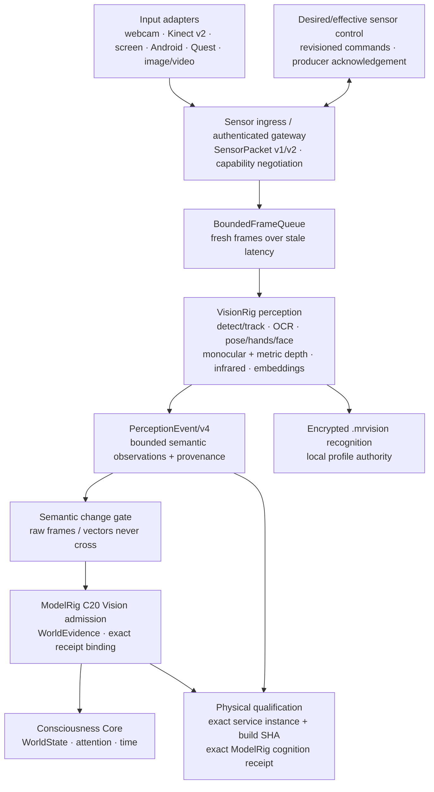

# VisionRig architecture

_Last reviewed against `main` on 2026-10-01._

## Authority boundary

VisionRig owns the technical transformation from visual inputs into typed
observations. It is **not** authoritative about durable identity, intent,
emotion, memory, actions or Consciousness Core state.

## Design rules

1. Raw pixels do not enter Consciousness Core.
2. Raw embedding vectors do not enter Consciousness Core.
3. Every public observation carries provenance, sequence and confidence where
   the producing model actually supplies one.
4. Core contracts stay CPU-only and model-agnostic.
5. GPU/model stacks are optional adapters.
6. VisionRig state is ephemeral by default; durable memory belongs to ModelRig.
7. Recognition results are hints, never unquestioned identity truth.
8. A model adapter cannot gain tool, body, voice, memory-write or action authority.
9. Live capture is bounded; overload drops stale frames rather than accumulating latency.
10. Tracking ids express short-term continuity only.
11. ONNX deployment artifacts are explicitly manifested, checksummed and
    provenance/licence annotated; VisionRig never silently downloads them.

## Contract change: v1 -> v2

V1 was intentionally replaced before the ModelRig bridge existed. V2 adds typed
landmark and depth surfaces so pose/hands/depth do not get smuggled through
generic labels. No downstream production consumer had been established, making
this the safe point for the breaking contract correction.

## Slices

### V0 — foundation — complete
Strict contracts, pipeline protocol, ephemeral world snapshot and local API.

### V1 — capture/runtime — complete
Webcam/image/video/Kinect v2 sources, bounded frame queue, backpressure and capability probing.

### V2A — detection/tracking — complete
Verified YOLO-style ONNX detector and per-source short-term IoU tracking.

### V2B — multimodal perception — implemented
Tesseract OCR, MediaPipe landmarks, generic ONNX relative depth, bounded
sidecar visual embeddings, v2 event contracts and CLI composition.

### V3 — recognition and .mrvision — implemented
Encrypted/local visual profile with face/body/object/place embeddings, explicit
enrollment, revocation and revisioning. Global models remain shared.

### V3B — metric depth + 3D ordering — implemented
Hardware sensors can preserve measured distance in metres. Spatial fusion emits
front/behind ordering only from metric depth and keeps monocular estimates
explicitly relative.

### V4 — ModelRig bridge — implemented
Publish only semantic PerceptionEvent v4 changes to a strict loopback ModelRig
C20 adapter. Exact event refs are receipt-bound; OCR text, identity hints and
raw frame modalities remain outside cognitive context. Delivery failure is
isolated from local perception.

### V5 — sensor control and Kaliv ingress — implemented foundation
Authenticated Windows/screen/camera and Kaliv VR/passthrough producer transport,
persistent sensor catalog/discovery, stable source identity, desired-state control,
effective-state convergence, and managed local webcam/Kinect control are
implemented. A shared Kotlin/JVM Kaliv producer core is implemented under `clients/kaliv-producer-core`, covering authenticated transport, desired-state convergence and crash-safe sequence/drop state. Native Android CameraX and Quest 3/3S passthrough Camera2 adapters are implemented and both platform sessions expose the shared coroutine cadence/lifecycle runner.

### V6 — operational sensor observability — implemented
VisionRig 0.86.0 exposes coherent sensor bootstrap snapshots, restart-detectable
change streams, producer-readiness events, online-readiness expiry, heartbeat
contract transitions, packet-target telemetry, and blocker-stage migration
diagnostics. The current public operator contracts are fleet v31, bootstrap v36,
and health v64.

### V7 — physical perception qualification — implemented foundation
Physical Kinect v2 acceptance and generic physical-perception qualification bind
fresh physical sensor evidence to exact ModelRig bridge receipts without granting
identity, memory-write, execution, scheduling, or production authority. The Kinect
gate also requires each physical infrared frame to yield a bounded
`InfraredObservation` in PerceptionEvent/v4.

## Contract change: v2 -> v3

V3 adds optional `distance_m` to each depth observation and adds
`in_front_of` / `behind` relation predicates. The metric field is populated
only by adapters with a calibrated/measured distance source. Relative monocular
depth remains valid but cannot manufacture metric ordering.

## Current repository state

As of VisionRig 0.99.0, `main` is the authoritative implementation branch.
Historical feature branches may remain for provenance, but they are not a source
of newer runtime behavior unless explicitly rebased into a new pull request.

The shared native producer core plus Android CameraX and Quest 3/3S Camera2 clients have landed. Both platform sessions expose the shared coroutine cadence runner; application UI and ownership of the coroutine lifecycle remain client concerns.

## Contract change: v3 -> v4

V4 adds frame-level `InfraredObservation` summaries to PerceptionEvent while
keeping raw infrared planes inside `Frame.sensor_data`.

WorldSnapshot remains v3 because infrared summaries are transient sensor
observations rather than durable visual-world state. ModelRig admission remains
non-authoritative and receives only the bounded normalized summary, never raw IR
pixels.

### V7 qualification hardening

VisionRig 0.89.0 tightens generic physical qualification so a fresh camera/VR frame is not sufficient by itself: the qualifying PerceptionEvent/v4 must also contain at least one bounded semantic observation (entity, relation, landmark, depth, infrared summary, or non-empty scene label) before an exact-bound ModelRig receipt can satisfy the gate.

### V7 service-instance binding

VisionRig 0.95.0 exposes a process-unique `service_instance_id` in health v66. Generic physical qualification binds its full evidence run to that instance and fails closed if VisionRig restarts before the exact physical event is admitted and finalized. The receipt records the instance id alongside the health/perception contract identifiers.

### V7 build identity

VisionRig 0.96.0 health v67 adds runtime build identity: semantic package version plus an optional validated git revision sourced from `VISIONRIG_GIT_SHA`. Physical qualification can require an operator-supplied expected SHA and binds its receipt to the running build rather than only to the process instance.

### V7 ModelRig cognition proof

VisionRig 0.97.0 binds physical qualification beyond WorldState change to the downstream ModelRig attention-admission proof. Fresh qualifying admissions must carry the canonical world-evidence reference and prove that the fresh path queued a typed cognition event with a canonical event id. Replay remains disallowed.

### V7 Kinect cognition-proof parity

VisionRig 0.98.0 brings the dedicated Kinect physical gate to parity with generic physical qualification. A fresh physical Kinect admission is not sufficient until ModelRig proves both WorldState change and downstream typed cognition-event queueing with canonical evidence and cognition references.

### V7 bridge receipt reference validation

The VisionRig → ModelRig bridge validates canonical receipt references at the parsing boundary, before release qualification consumes them. `visionrig_event_ref` must match `visionrig-event:<64hex>`, `evidence_ref` must match `world-evidence-event:<64hex>`, and cognition queue state must be consistent with a canonical `cevt-<32hex>` cognition event id. Invalid downstream receipts are rejected and never committed to semantic-change state.

### V7 ModelRig admission-shape validation

VisionRig now validates the semantic shape of ModelRig admission receipts at the bridge boundary. A replay must not change WorldState and must not queue cognition; a fresh admission must change WorldState and must queue exactly one cognition event. Receipts that contradict those invariants are rejected before semantic state is committed or release qualification observes them.

### V7 cognition-event evidence binding

For fresh VisionRig world evidence, ModelRig derives the cognition event id deterministically from the canonical world-evidence reference and the fixed `world_change` cognition kind. VisionRig validates that exact derivation at the bridge boundary, so a syntactically valid but unrelated cognition id cannot be accepted as downstream proof.

### V1 release-candidate baseline

VisionRig 0.99.0 is the pre-1.0 release-candidate baseline. It includes the
shared native Kotlin producer core, Android CameraX and Quest 3/3S Camera2
clients, coroutine cadence/lifecycle support, capability negotiation, exact
ModelRig cognition-proof binding, canonical physical release evidence, and
final service-instance/build revalidation during physical qualification.

Promotion to 1.0 should be based on release evidence rather than another broad
architecture slice: clean repository CI plus physical acceptance on the target
sensor/client hardware. Hardware acceptance remains fail-closed and external to
the semantic version number itself.
